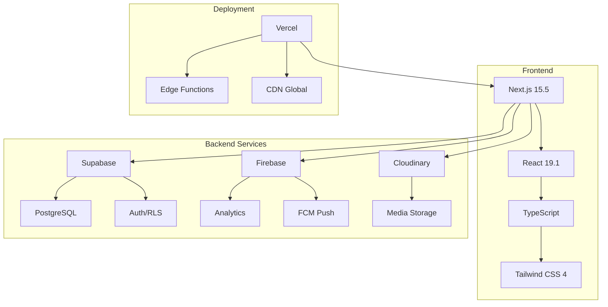
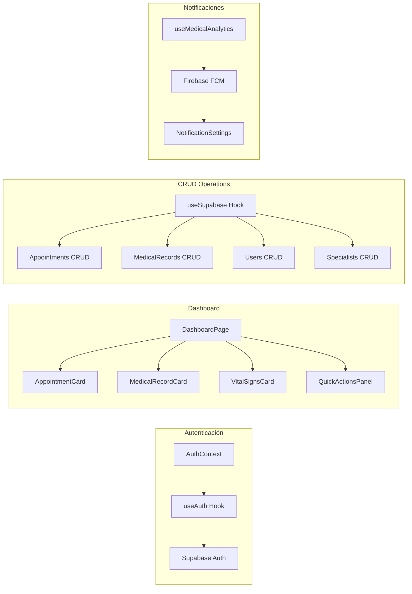
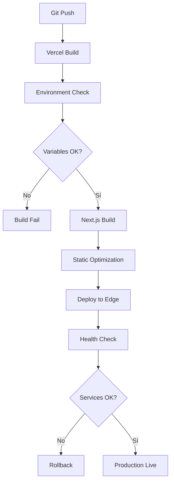
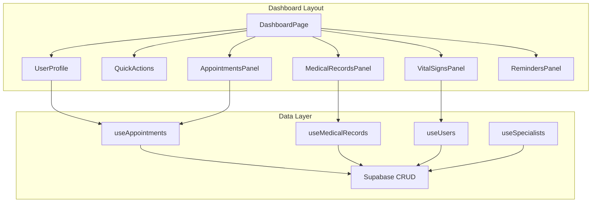
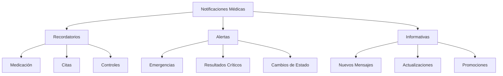
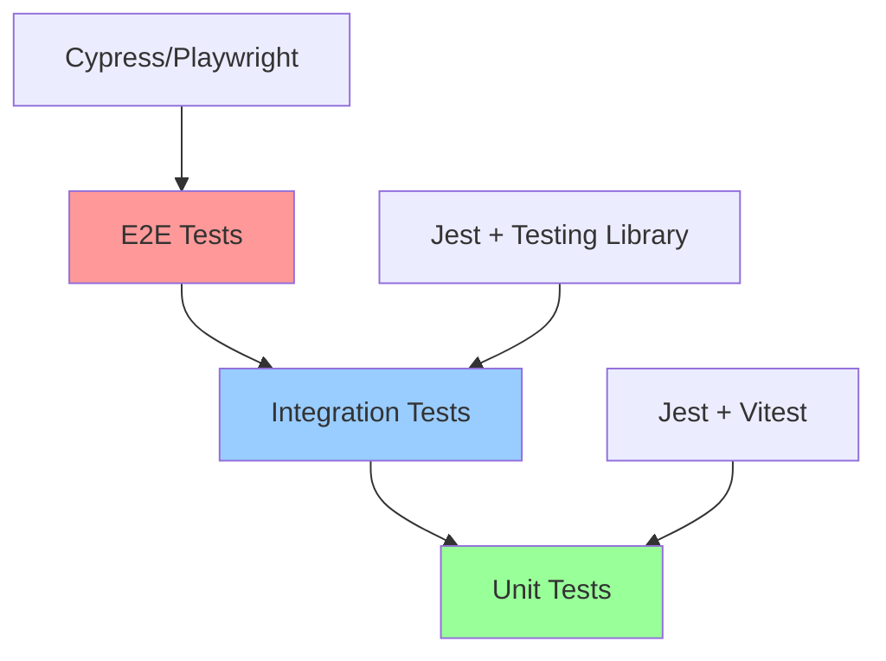
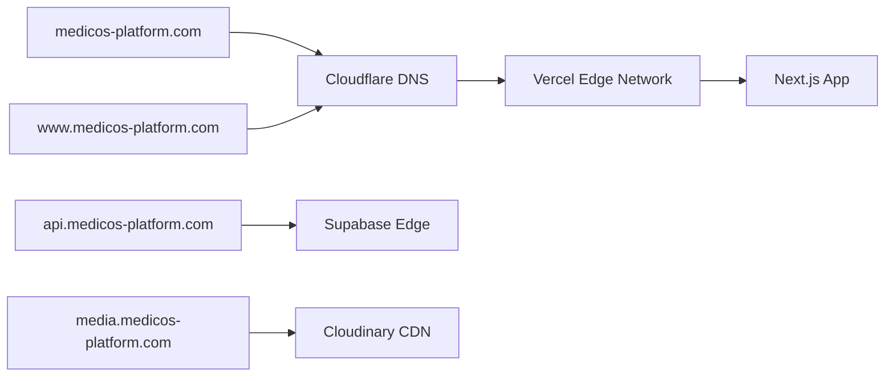
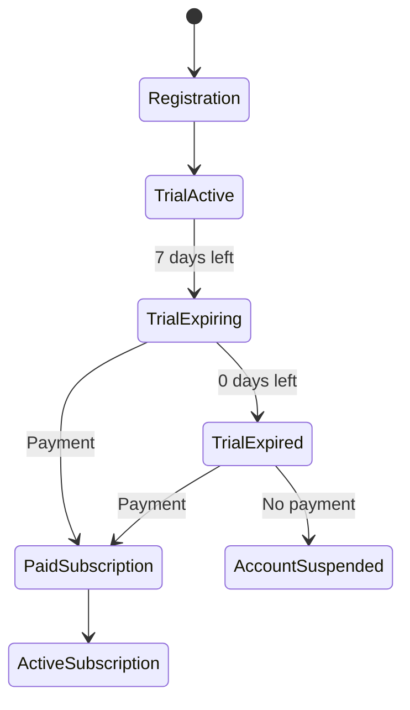
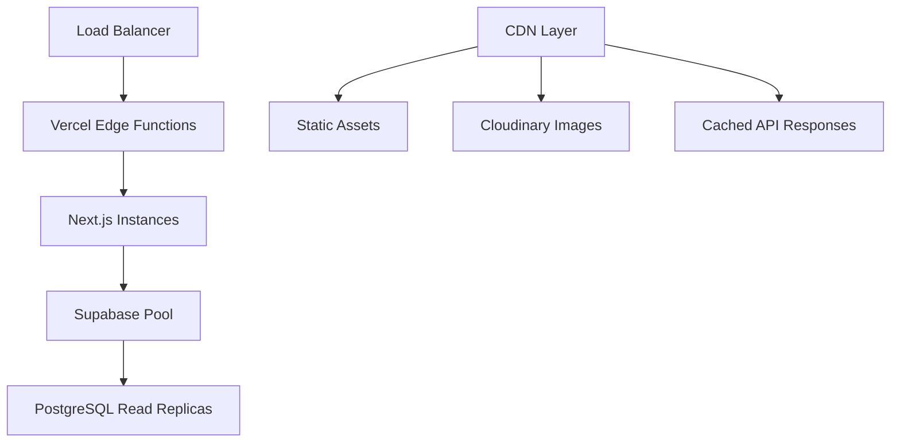

# Diseño: Despliegue en Producción e Implementación de Funcionalidades Clave

## Resumen Ejecutivo

Este documento detalla la arquitectura y estrategia de implementación para llevar la Plataforma Médica a producción completa, incluyendo despliegue verificado en Vercel, implementación del dashboard funcional con operaciones CRUD, integración de notificaciones push, gestión multimedia, y configuración de seguridad robusta.

## Arquitectura del Sistema

### Stack Tecnológico Actual



### Arquitectura de Componentes



## 1. Despliegue y Verificación en Producción

### 1.1 Configuración de Variables de Entorno

#### Variables Críticas de Producción

| Variable | Descripción | Configurado |
|----------|-------------|-------------|
| `NEXT_PUBLIC_SUPABASE_URL` | URL del proyecto Supabase | ✅ |
| `NEXT_PUBLIC_SUPABASE_ANON_KEY` | Clave anónima Supabase | ✅ |
| `SUPABASE_SERVICE_ROLE_KEY` | Clave de servicio para operaciones admin | ✅ |
| `NEXT_PUBLIC_FIREBASE_API_KEY` | API Key de Firebase | ✅ |
| `NEXT_PUBLIC_FCM_VAPID_KEY` | Clave VAPID para notificaciones | ✅ |
| `NEXT_PUBLIC_CLOUDINARY_CLOUD_NAME` | Nombre del cloud Cloudinary | ✅ |
| `CLOUDINARY_API_KEY` | API Key Cloudinary | ✅ |
| `CLOUDINARY_API_SECRET` | Secret Cloudinary | ✅ |

### 1.2 Pipeline de Despliegue



### 1.3 Verificación de Servicios

#### Checklist de Verificación Post-Despliegue

```typescript
// Estructura del servicio de verificación
interface HealthCheck {
  service: string;
  status: 'healthy' | 'degraded' | 'down';
  responseTime: number;
  lastCheck: Date;
}

interface ProductionVerification {
  authentication: {
    login: boolean;
    registration: boolean;
    logout: boolean;
    sessionPersistence: boolean;
  };
  database: {
    connection: boolean;
    rls: boolean;
    crud: boolean;
  };
  external: {
    firebase: boolean;
    cloudinary: boolean;
    notifications: boolean;
  };
  performance: {
    loadTime: number;
    interactivity: number;
    lcp: number;
  };
}
```

## 2. Implementación del Dashboard y Funcionalidades CRUD

### 2.1 Arquitectura del Dashboard

#### Estructura de Componentes



### 2.2 Modelo de Datos Extendido

#### Tablas Supabase Principales

```sql
-- Tabla de especialidades médicas
CREATE TABLE medical_specialties (
  id UUID PRIMARY KEY DEFAULT gen_random_uuid(),
  name VARCHAR(255) NOT NULL,
  description TEXT,
  icon VARCHAR(100),
  is_active BOOLEAN DEFAULT true,
  created_at TIMESTAMP WITH TIME ZONE DEFAULT NOW()
);

-- Tabla de citas médicas
CREATE TABLE appointments (
  id UUID PRIMARY KEY DEFAULT gen_random_uuid(),
  patient_id UUID REFERENCES users(id),
  doctor_id UUID REFERENCES users(id),
  specialty_id UUID REFERENCES medical_specialties(id),
  appointment_date TIMESTAMP WITH TIME ZONE NOT NULL,
  duration_minutes INTEGER DEFAULT 30,
  status VARCHAR(50) DEFAULT 'scheduled',
  type VARCHAR(50) DEFAULT 'consultation',
  notes TEXT,
  symptoms TEXT[],
  diagnosis TEXT,
  treatment TEXT,
  prescription JSONB,
  created_at TIMESTAMP WITH TIME ZONE DEFAULT NOW(),
  updated_at TIMESTAMP WITH TIME ZONE DEFAULT NOW()
);

-- Tabla de historiales médicos
CREATE TABLE medical_records (
  id UUID PRIMARY KEY DEFAULT gen_random_uuid(),
  patient_id UUID REFERENCES users(id),
  doctor_id UUID REFERENCES users(id),
  appointment_id UUID REFERENCES appointments(id),
  date TIMESTAMP WITH TIME ZONE NOT NULL,
  diagnosis TEXT NOT NULL,
  symptoms TEXT[],
  treatment TEXT,
  notes TEXT,
  attachments TEXT[],
  follow_up_date TIMESTAMP WITH TIME ZONE,
  created_at TIMESTAMP WITH TIME ZONE DEFAULT NOW()
);

-- Tabla de medicamentos
CREATE TABLE medications (
  id UUID PRIMARY KEY DEFAULT gen_random_uuid(),
  patient_id UUID REFERENCES users(id),
  prescribed_by UUID REFERENCES users(id),
  name VARCHAR(255) NOT NULL,
  dosage VARCHAR(100),
  frequency VARCHAR(100),
  start_date DATE NOT NULL,
  end_date DATE,
  notes TEXT,
  is_active BOOLEAN DEFAULT true,
  created_at TIMESTAMP WITH TIME ZONE DEFAULT NOW()
);
```

### 2.3 Hooks para Operaciones CRUD

#### Hook de Citas Médicas

```typescript
interface AppointmentFilters {
  status?: AppointmentStatus[];
  dateFrom?: Date;
  dateTo?: Date;
  specialtyId?: string;
}

interface UseAppointmentsReturn {
  appointments: Appointment[];
  loading: boolean;
  error: string | null;
  createAppointment: (data: CreateAppointmentData) => Promise<Appointment>;
  updateAppointment: (id: string, data: Partial<Appointment>) => Promise<Appointment>;
  cancelAppointment: (id: string, reason?: string) => Promise<void>;
  getAppointmentsByUser: (userId: string, filters?: AppointmentFilters) => Promise<Appointment[]>;
  getUpcomingAppointments: (userId: string, limit?: number) => Promise<Appointment[]>;
}
```

#### Hook de Historiales Médicos

```typescript
interface UseMedicalRecordsReturn {
  records: MedicalRecord[];
  loading: boolean;
  error: string | null;
  createRecord: (data: CreateMedicalRecordData) => Promise<MedicalRecord>;
  updateRecord: (id: string, data: Partial<MedicalRecord>) => Promise<MedicalRecord>;
  getRecordsByPatient: (patientId: string) => Promise<MedicalRecord[]>;
  getRecordsByDoctor: (doctorId: string) => Promise<MedicalRecord[]>;
  attachFile: (recordId: string, fileUrl: string) => Promise<void>;
}
```

### 2.4 Dashboard Responsivo

#### Breakpoints y Layout

```css
/* Configuración de diseño responsivo */
.dashboard-grid {
  display: grid;
  gap: 1.5rem;
  
  /* Mobile */
  grid-template-columns: 1fr;
  
  /* Tablet */
  @media (min-width: 768px) {
    grid-template-columns: 1fr 1fr;
  }
  
  /* Desktop */
  @media (min-width: 1024px) {
    grid-template-columns: 2fr 1fr;
  }
  
  /* Large Desktop */
  @media (min-width: 1280px) {
    grid-template-columns: 3fr 2fr 1fr;
  }
}
```

#### Estructura de Accesibilidad

```typescript
interface AccessibilityFeatures {
  screenReader: {
    ariaLabels: boolean;
    semanticHTML: boolean;
    focusManagement: boolean;
  };
  keyboard: {
    tabNavigation: boolean;
    shortcutKeys: boolean;
    skipLinks: boolean;
  };
  visual: {
    highContrast: boolean;
    fontSize: 'small' | 'medium' | 'large';
    colorBlindFriendly: boolean;
  };
}
```

## 3. Integración de Notificaciones y Multimedia

### 3.1 Firebase Cloud Messaging

#### Configuración de Service Worker

```javascript
// public/firebase-messaging-sw.js
importScripts('https://www.gstatic.com/firebasejs/10.0.0/firebase-app-compat.js');
importScripts('https://www.gstatic.com/firebasejs/10.0.0/firebase-messaging-compat.js');

const firebaseConfig = {
  // Configuración de Firebase
};

firebase.initializeApp(firebaseConfig);
const messaging = firebase.messaging();

messaging.onBackgroundMessage((payload) => {
  const notificationTitle = payload.notification.title;
  const notificationOptions = {
    body: payload.notification.body,
    icon: '/icons/medical-icon-192.png',
    badge: '/icons/medical-badge-72.png',
    tag: 'medical-notification',
    data: payload.data,
    actions: [
      {
        action: 'view',
        title: 'Ver detalles'
      },
      {
        action: 'dismiss',
        title: 'Descartar'
      }
    ]
  };

  self.registration.showNotification(notificationTitle, notificationOptions);
});
```

#### Hook de Notificaciones

```typescript
interface NotificationHookReturn {
  permission: NotificationPermission;
  token: string | null;
  requestPermission: () => Promise<boolean>;
  subscribeToTopic: (topic: string) => Promise<void>;
  unsubscribeFromTopic: (topic: string) => Promise<void>;
  sendNotification: (data: NotificationData) => Promise<void>;
}

interface NotificationData {
  title: string;
  body: string;
  icon?: string;
  data?: Record<string, any>;
  target: 'user' | 'role' | 'topic';
  targetId: string;
}
```

### 3.2 Tipos de Notificaciones Médicas

#### Categorías de Notificaciones



### 3.3 Integración Cloudinary

#### Configuración de Upload

```typescript
interface CloudinaryUploadOptions {
  folder: string;
  resourceType: 'image' | 'video' | 'pdf' | 'auto';
  transformation?: {
    width?: number;
    height?: number;
    crop?: string;
    quality?: string;
  };
  tags?: string[];
}

interface UseCloudinaryReturn {
  upload: (file: File, options: CloudinaryUploadOptions) => Promise<CloudinaryResponse>;
  uploadMultiple: (files: File[], options: CloudinaryUploadOptions) => Promise<CloudinaryResponse[]>;
  delete: (publicId: string) => Promise<void>;
  getOptimizedUrl: (publicId: string, transformations?: object) => string;
  loading: boolean;
  error: string | null;
}
```

#### Estructura de Carpetas

```
cloudinary/
├── medical-platform/
│   ├── profiles/
│   │   ├── patients/
│   │   └── doctors/
│   ├── medical-records/
│   │   ├── documents/
│   │   ├── images/
│   │   └── lab-results/
│   ├── prescriptions/
│   └── certificates/
```

## 4. Pruebas y Calidad

### 4.1 Estrategia de Testing

#### Pirámide de Pruebas



#### Test Suites Principales

```typescript
interface TestConfiguration {
  unit: {
    components: string[];
    hooks: string[];
    utils: string[];
    coverage: {
      threshold: 80;
      functions: 85;
      lines: 80;
      statements: 80;
    };
  };
  integration: {
    api: string[];
    database: string[];
    auth: string[];
  };
  e2e: {
    userJourneys: string[];
    crossBrowser: boolean;
    mobile: boolean;
  };
}
```

### 4.2 Monitoreo y Errores

#### Configuración de Sentry

```typescript
interface ErrorMonitoring {
  sentry: {
    dsn: string;
    environment: 'development' | 'staging' | 'production';
    tracesSampleRate: number;
    integrations: string[];
  };
  customMetrics: {
    performance: boolean;
    userSessions: boolean;
    apiLatency: boolean;
    errorRates: boolean;
  };
}
```

## 5. Configuración de Dominio y Seguridad

### 5.1 Configuración de Dominio

#### DNS y CDN Setup



### 5.2 Políticas de Seguridad

#### Content Security Policy

```javascript
const securityHeaders = [
  {
    key: 'Content-Security-Policy',
    value: [
      "default-src 'self'",
      "script-src 'self' 'unsafe-eval' 'unsafe-inline' *.vercel.app *.firebase.com *.cloudinary.com",
      "style-src 'self' 'unsafe-inline' fonts.googleapis.com",
      "font-src 'self' fonts.gstatic.com",
      "img-src 'self' data: blob: *.cloudinary.com *.supabase.co",
      "connect-src 'self' *.supabase.co *.firebase.com *.cloudinary.com",
      "frame-ancestors 'none'",
      "base-uri 'self'",
      "form-action 'self'"
    ].join('; ')
  },
  {
    key: 'X-Frame-Options',
    value: 'DENY'
  },
  {
    key: 'X-Content-Type-Options',
    value: 'nosniff'
  },
  {
    key: 'Referrer-Policy',
    value: 'strict-origin-when-cross-origin'
  },
  {
    key: 'Permissions-Policy',
    value: 'camera=(), microphone=(), geolocation=()'
  }
];
```

#### Rate Limiting y Protección

```typescript
interface SecurityMeasures {
  rateLimiting: {
    login: { requests: 5, window: '15m' };
    api: { requests: 100, window: '1h' };
    registration: { requests: 3, window: '1h' };
  };
  inputValidation: {
    sanitization: boolean;
    xssProtection: boolean;
    sqlInjectionPrevention: boolean;
  };
  dataProtection: {
    encryption: 'AES-256';
    hipaaCompliant: boolean;
    auditLogging: boolean;
  };
}
```

## 6. Mejoras y Nuevas Funcionalidades

### 6.1 Sistema de "Mes Gratis"

#### Arquitectura del Trial



#### Modelo de Datos Trial

```sql
CREATE TABLE user_subscriptions (
  id UUID PRIMARY KEY DEFAULT gen_random_uuid(),
  user_id UUID REFERENCES users(id),
  plan_type VARCHAR(50) NOT NULL, -- 'trial', 'basic', 'premium'
  status VARCHAR(50) NOT NULL, -- 'active', 'expired', 'cancelled'
  trial_start_date TIMESTAMP WITH TIME ZONE,
  trial_end_date TIMESTAMP WITH TIME ZONE,
  subscription_start_date TIMESTAMP WITH TIME ZONE,
  subscription_end_date TIMESTAMP WITH TIME ZONE,
  payment_method JSONB,
  billing_cycle VARCHAR(20), -- 'monthly', 'yearly'
  created_at TIMESTAMP WITH TIME ZONE DEFAULT NOW(),
  updated_at TIMESTAMP WITH TIME ZONE DEFAULT NOW()
);
```

### 6.2 Funcionalidades Avanzadas

#### Telemedicina

```typescript
interface TelemedicineFeatures {
  videoConsultation: {
    provider: 'WebRTC' | 'Agora' | 'Twilio';
    recording: boolean;
    screenSharing: boolean;
    chatIntegration: boolean;
  };
  prescriptionManagement: {
    electronicPrescription: boolean;
    drugInteractionCheck: boolean;
    pharmacyIntegration: boolean;
  };
  vitalSigns: {
    remoteMonitoring: boolean;
    deviceIntegration: boolean;
    alertSystem: boolean;
  };
}
```

#### Analytics Médicos

```typescript
interface MedicalAnalytics {
  patientMetrics: {
    appointmentHistory: boolean;
    treatmentOutcomes: boolean;
    adherenceTracking: boolean;
  };
  doctorMetrics: {
    performanceKPIs: boolean;
    patientSatisfaction: boolean;
    scheduleOptimization: boolean;
  };
  systemMetrics: {
    usageStatistics: boolean;
    featureAdoption: boolean;
    performanceMonitoring: boolean;
  };
}
```

## Especificaciones Técnicas de Implementación

### Performance Targets

| Métrica | Target | Actual |
|---------|--------|--------|
| First Contentful Paint | < 1.5s | TBD |
| Largest Contentful Paint | < 2.5s | TBD |
| Cumulative Layout Shift | < 0.1 | TBD |
| Time to Interactive | < 3.5s | TBD |

### Escalabilidad



### Monitoreo Continuo

```typescript
interface MonitoringStack {
  uptime: 'Vercel Analytics' | 'UptimeRobot';
  performance: 'Web Vitals' | 'Lighthouse CI';
  errors: 'Sentry' | 'LogRocket';
  logs: 'Vercel Logs' | 'Supabase Logs';
  alerts: {
    slack: boolean;
    email: boolean;
    sms: boolean;
  };
}
```